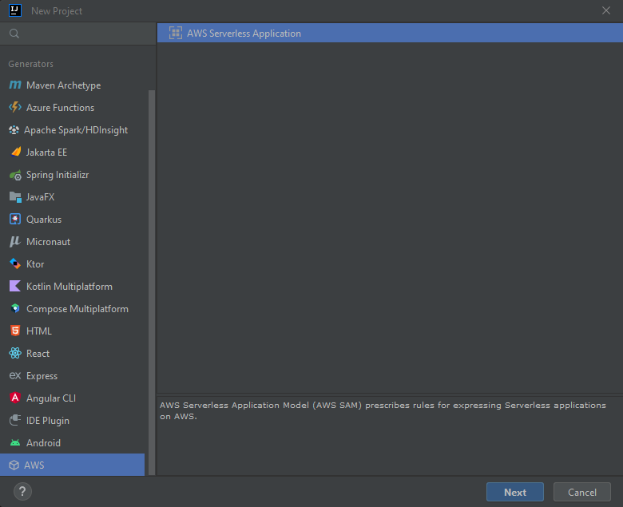
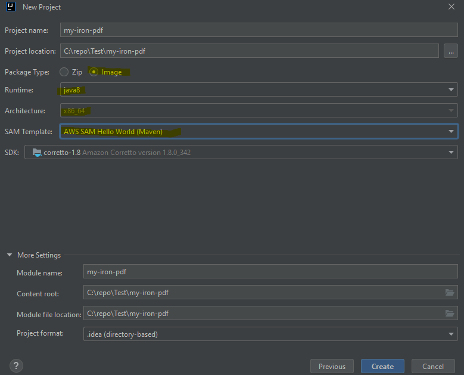

# How to Run IronPDF for Java in AWS Lambda


# Important: Required Settings
* Zip Deployment is not supported, since IronPDF requires execution of binaries at runtime.
* You must set `PackageType` to `Image`. Because IronPDF for Java only supports Docker deployment.
* You must use `AmazonLinux2` docker image.
* You must set the following IronPdfEngineWorkingDirectory:
```java
Setting.setIronPdfEngineWorkingDirectory(Paths.get("/tmp/"));
```
**Required** because it is the only path that AWS allows for execution environment.
* Increase the `/tmp` size, Default value is 512 MB. Please set it to at least 1024 MB.
* Include the `ironpdf-engine-linux-x64` dependency to your project:
```xml
 <dependency>
    <groupId>com.ironsoftware</groupId>
    <artifactId>ironpdf-engine-linux-x64</artifactId>
    <version>2022.xx.x</version>
</dependency>
```
* Set Lambda timeout to 330 seconds due to slow start.
* Set Lambda memory size to at least 1024 MB.

## Quick Start with AWS Toolkit for IntelliJ IDEA (AWS SAM)
1. Install Tools:
    * IntelliJ IDEA https://www.jetbrains.com/idea/download/
    * AWS Toolkit: https://docs.aws.amazon.com/toolkit-for-jetbrains/latest/userguide/setup-toolkit.html
    * SAM CLI - [Install the SAM CLI](https://docs.aws.amazon.com/serverless-application-model/latest/developerguide/serverless-sam-cli-install.html)
    * Docker - [Install Docker community edition](https://hub.docker.com/search/?type=edition&offering=community)

    You may also need the following for local testing:
    * Java8 - [Install the Java SE Development Kit 8](http://www.oracle.com/technetwork/java/javase/downloads/jdk8-downloads-2133151.html)
    * Maven - [Install Maven](https://maven.apache.org/install.html)


2. Create project. (`File` -> `New` -> `Project...`)



3. Config:
    * Package Type : `Image`
    * Runtime : `java8` or `java11`
    * SAM Templage : `Maven`



4. Add the following dependencies to your `pom.xml`:
```xml
<dependency>
    <groupId>org.slf4j</groupId>
    <artifactId>slf4j-simple</artifactId>
    <version>2.0.17</version>
</dependency>

<dependency>
    <groupId>com.ironsoftware</groupId>
    <artifactId>ironpdf-engine-linux-x64</artifactId>
    <version>2022.11.1</version>
</dependency>

<dependency>
    <groupId>io.perfmark</groupId>
    <artifactId>perfmark-api</artifactId>
    <version>0.26.0</version>
</dependency>

<dependency>
    <groupId>io.grpc</groupId>
    <artifactId>grpc-okhttp</artifactId>
    <version>1.50.2</version>
</dependency>

<dependency>
    <groupId>io.grpc</groupId>
    <artifactId>grpc-netty-shaded</artifactId>
    <version>1.50.2</version>
</dependency>
```
5. Change the `handleRequest` function code in `App.java` to:
```java
import com.ironsoftware.ironpdf.*;
public APIGatewayProxyResponseEvent handleRequest(final APIGatewayProxyRequestEvent input, final Context context) {
        APIGatewayProxyResponseEvent response = new APIGatewayProxyResponseEvent();
        Settings.setDebug(true); //optional
        Settings.setIronPdfEngineWorkingDirectory(Paths.get("/tmp/")); //requried!
        try {
            context.getLogger().log("RENDER PDF");
            PdfDocument pdf = PdfDocument.renderUrlAsPdf("https://www.google.com");
            context.getLogger().log("RENDER PDF SUCCESS");
            pdf.saveAs("/tmp/my-first-pdf.pdf");
            //Done! Now you can do anything with the pdf such as upload this pdf to S3.
            //return something..
            Map<String, String> headers = new HashMap<>();
            headers.put("Content-Type", "application/json");
            headers.put("X-Custom-Header", "application/json");
            APIGatewayProxyResponseEvent response = new APIGatewayProxyResponseEvent()
                    .withHeaders(headers);
            return response
                    .withStatusCode(200)
                    .withBody("ENJOY IRON-PDF!");
        } catch (Exception e) {
            return response
                    .withBody("{" + e.getMessage() + "}")
                    .withStatusCode(500);
        }
    }
```

6. Set Lambda config at `template.yaml`:
```
Globals:
  Function:
    Timeout: 400
    MemorySize: 2048
    EphemeralStorage:
      Size: 1024
#don't touch the other config    
```
7. Update Dockerfile to the following:
* Note: for Java8 please use `java8.al2` images because it uses `AmazonLinux2`, but `java8` uses the old `AmazonLinux`. 
```Dockerfile
FROM public.ecr.aws/sam/build-java8.al2:latest as build-image
WORKDIR "/task"
COPY src/ src/
COPY pom.xml ./
RUN mvn -q clean install
RUN mvn dependency:copy-dependencies -DincludeScope=compile
FROM public.ecr.aws/lambda/java:8.al2
RUN yum update -y
RUN yum install -y pango.x86_64
RUN yum install -y libXcomposite.x86_64
RUN yum install -y libXcursor.x86_64
RUN yum install -y libXdamage.x86_64
RUN yum install -y libXext.x86_64
RUN yum install -y libXi.x86_64
RUN yum install -y libXtst.x86_64
RUN yum install -y cups-libs.x86_64
RUN yum install -y libXScrnSaver.x86_64
RUN yum install -y libXrandr.x86_64
RUN yum install -y GConf2.x86_64
RUN yum install -y alsa-lib.x86_64
RUN yum install -y atk.x86_64
RUN yum install -y gtk3.x86_64
RUN yum install -y ipa-gothic-fonts
RUN yum install -y xorg-x11-fonts-100dpi
RUN yum install -y xorg-x11-fonts-75dpi
RUN yum install -y xorg-x11-utils
RUN yum install -y xorg-x11-fonts-cyrillic
RUN yum install -y xorg-x11-fonts-Type1
RUN yum install -y xorg-x11-fonts-misc
RUN yum install -y glibc-devel.x86_64
RUN yum install -y at-spi2-atk.x86_64
RUN yum install -y mesa-libgbm.x86_64
RUN yum install -y libxkbcommon
RUN yum install -y amazon-linux-extras
RUN amazon-linux-extras install epel -y
RUN yum install -y libgdiplus
RUN chmod 777 /tmp/
COPY --from=build-image /task/target/classes /var/task/
COPY --from=build-image /task/target/dependency /var/task/lib
# Command can be overwritten by providing a different command in the template directly.
CMD ["helloworld.App::handleRequest"]
```

8. Build with:
```bash
sam build -u
```

9. Deploy with:
```bash
sam deploy --guided
```

10. Enjoy IronPDF in AWS Lambda! Now your function is up at: https://console.aws.amazon.com/lambda/home